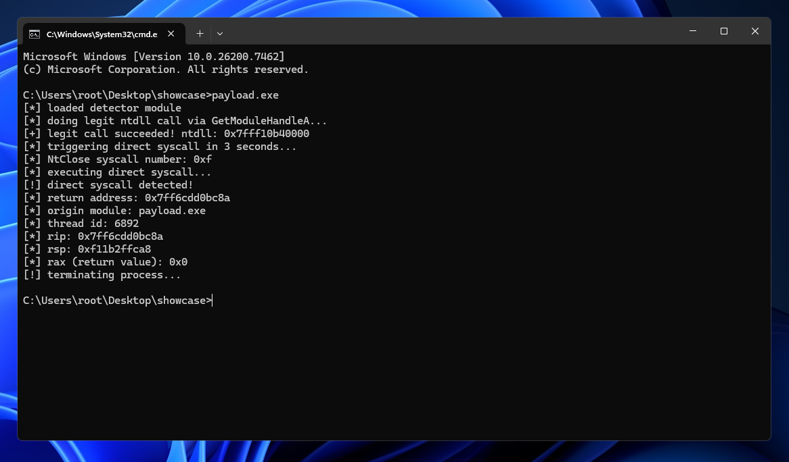

## syscall-detector

a lightweight antivirus proof-of-concept that detects and blocks malware using direct syscalls via windows instrumentation callbacks.

## showcase

## how it works

we register a process instrumentation callback that intercepts every kernel to user transition (sysret). on each syscall return, we validate that the return address (r10) points to a legitimate system module (ntdll.dll/win32u.dll). if not, the syscall originated from unauthorized code (direct syscall) and the process is terminated.

## detects

- inline syscall stubs
- copied/stolen syscall stubs
- manual `mov eax, SSN; syscall` sequences
- SysWhispers styled direct syscalls

## limitations

- does not detect indirect syscalls (jmp-to-ntdll techniques)
- most edrs mitigate indirect syscalls via inline hooks that destroy the syscall stub

## credits

- [@Peribunt](https://github.com/Peribunt) for instrumentation callback reference
